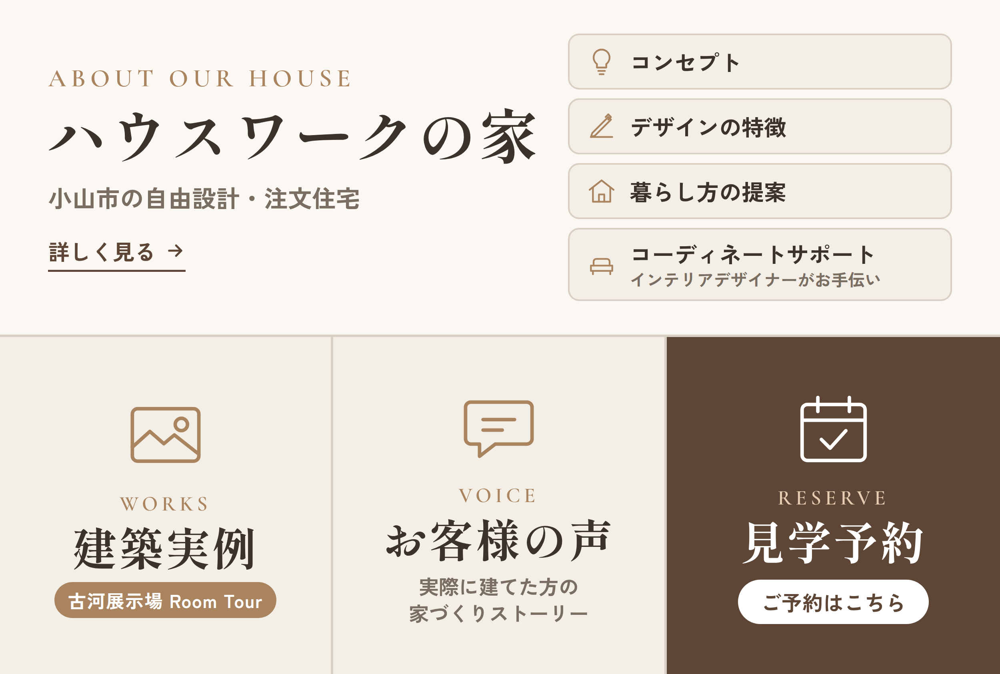

# 株式会社ハウスワーク LINEリッチメニュー



## 構成（大サイズ 2500×1686px／上1段＋下3分割）

| # | ボタン | 範囲 (x, y, 幅, 高さ) | リンク先（設定値） |
|---|---|---|---|
| 1 | ハウスワークの家（コンセプト・デザインの特徴・暮らし方の提案・インテリアデザイナーによるコーディネートサポート） | 0, 0, 2500, 843 | `URL_ABOUT` |
| 2 | 建築実例／古河展示場 Room Tour | 0, 843, 833, 843 | `URL_WORKS` |
| 3 | お客様の声 | 833, 843, 834, 843 | `URL_VOICE` |
| 4 | 見学予約 | 1667, 843, 833, 843 | `URL_RESERVE` |

## ファイル

- `richmenu.png`：アップロードする画像（1MB以下）
- `richmenu.html`：画像の元データ。文言や色を変える場合はここを編集して再書き出しします
- `richmenu.json`：タップ領域とアクションの定義（Messaging API 用）
- `deploy.mjs`：API で作成・画像アップロード・デフォルト設定までを一度に行うスクリプト
- `.env.example`：トークンと各リンク先の設定例

## 反映方法A：LINE公式アカウントの管理画面（手動）

1. LINE Official Account Manager →「リッチメニュー」→「作成」
2. テンプレートで**大サイズの「上1段＋下3分割」**を選択
3. 「画像をアップロード」で `richmenu.png` を選択
4. アクションを A〜D に設定（A＝上段、B・C・D＝下段の左から）
   - A：リンク → ハウスワークの家のページ
   - B：リンク → 建築実例／古河展示場 Room Tour のページ
   - C：リンク → お客様の声のページ
   - D：リンク → 見学予約フォーム
5. メニューバーのテキスト「メニューを開く」、表示期間、デフォルト表示を設定して保存

## 反映方法B：Messaging API（スクリプト）

Node.js 20.6 以上が必要です。

```bash
cd line-richmenu
cp .env.example .env   # トークンと各URLを記入（.env はコミットしない）
node --env-file=.env deploy.mjs
```

## 画像の再書き出し

`richmenu.html` を 2500×1686 のビューポートでスクリーンショットして `richmenu.png` を上書きします（Playwright などを使います）。
