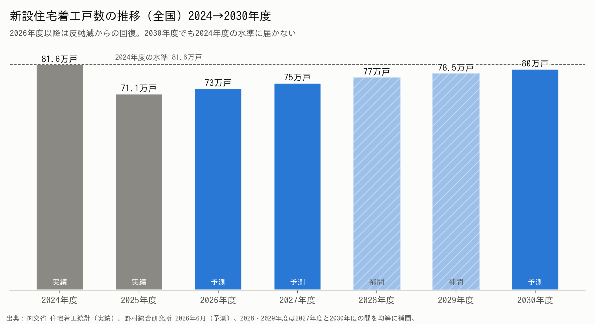
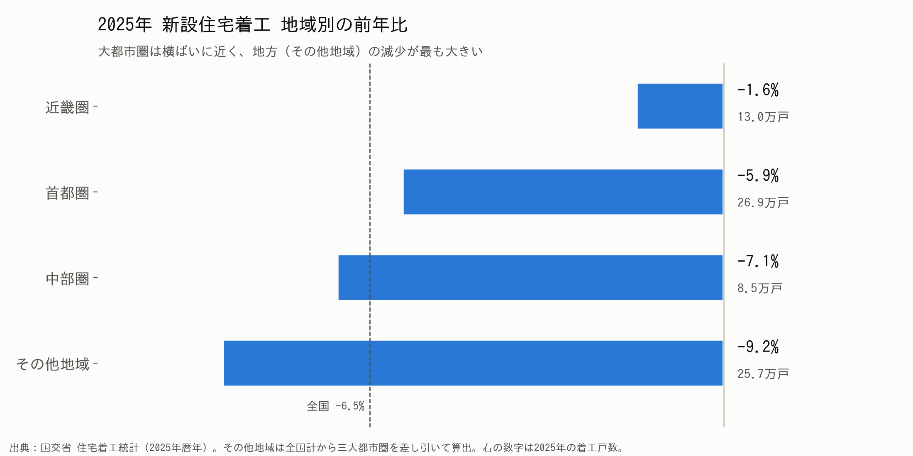
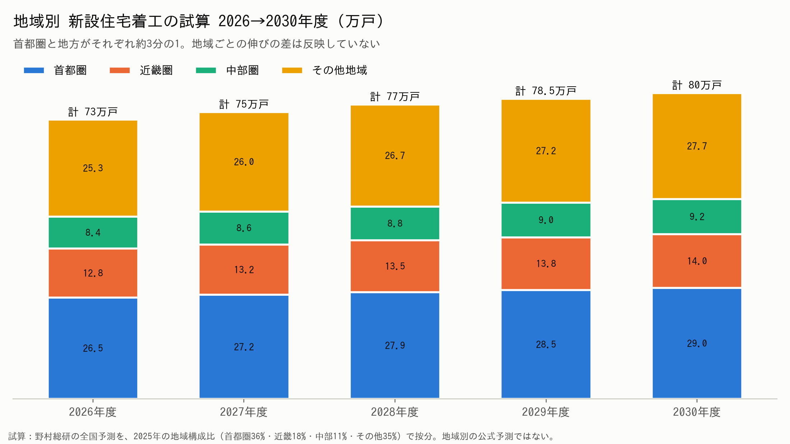
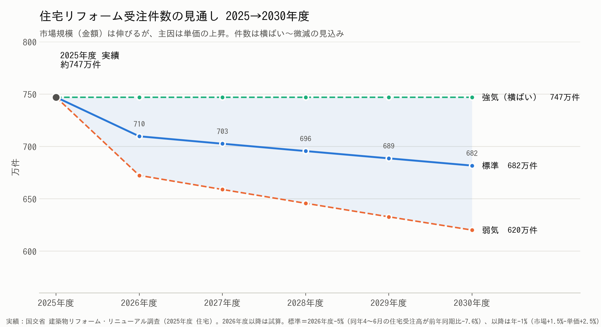

# 2026年 リフォーム業界 市場分析と事業展開の骨子

> 凡例：**【データ】**＝公的統計・調査機関の数値／**【試算】**＝データをもとにした仮説値（自社データで要検証）

---

## 1. 市場の全体像（新築 vs リフォーム）

| 指標 | 実績・予測 | 出典 |
|---|---|---|
| 新設住宅着工（2025年度） | **71.1万戸（前年度比 −12.9%）**／持家 20.1万戸（4年連続減、2021年比 約−30%） | 【データ】国交省 住宅着工統計 |
| 新設住宅着工（予測） | 2030年度 80万戸 → **2040年度 61万戸** | 【データ】野村総研（2026年6月） |
| リフォーム市場（2025年） | **7兆5,119億円（+2.5%）** | 【データ】矢野経済研究所 |
| リフォーム市場（2026年予測） | **約7.7兆円（+1.9%）** ※資材・人件費の上昇による単価アップが主因 | 【データ】矢野経済研究所 |
| リフォーム市場（長期） | 広義 2024年 約8.3兆円 → **2040年 9.2兆円** | 【データ】野村総研 |

**結論：新築は縮小、リフォームは「微増＋単価上昇」。件数より“1件あたりの提案価値”で勝負する市場になる。**

---

## 2. 家計の状況（買えない・買わない層の増加）

| 指標 | 数値 | 意味 | 出典 |
|---|---|---|---|
| 世帯平均所得（2024年） | **575.2万円**（+7.3%） | 平均値は上昇 | 【データ】厚労省 国民生活基礎調査2025 |
| 世帯所得の中央値 | **451万円** | 「普通の世帯」は約450万円 | 同上 |
| 平均を下回る世帯 | **61.5%** | 高所得層が平均を引き上げており、格差がある | 同上 |
| 実質賃金（2025年） | **−1.3%（4年連続マイナス）** | 名目は増えても生活実感は悪化 | 【データ】厚労省 毎月勤労統計 |

| 世帯タイプ | 行動 | 当社にとっての意味 |
|---|---|---|
| 高所得層（年収1,000万円〜） | 新築・高額リノベを両方検討 | デザイン性・提案力で選ばれる |
| 中間層（400〜800万円） | **新築はあきらめて「今の家を直す」** | **最大のボリュームゾーン** |
| 低所得層・高齢世帯 | 壊れたら直す（必要最低限） | 水回り・給湯器の交換需要 |

---

## 3. SWOT（2026年時点）

| | プラス要因 | マイナス要因 |
|---|---|---|
| **内部** | **S：強み** ・インテリアとリフォームを一体で提案できる ・店舗で実物を見せられる ・家具・内装・設備をまとめて扱える | **W：弱み** ・職人の確保・施工力に限りがある ・資材価格の上昇で見積もりが上がる ・提案から成約までに時間がかかる |
| **外部** | **O：機会** ・新築離れで「住み替えずにリフォーム」へ移行 ・築20年超の住宅が多く、水回りの交換時期を迎えている ・省エネ／断熱改修の補助金 ・SNSで「好み」はあるが「選べない」人が多い | **T：脅威** ・実質賃金のマイナスで予算が抑えられる ・ホームセンターやネット専業の低価格競争 ・職人の高齢化と人手不足 ・金利上昇でリフォームローンが組みにくくなる |

---

## 4. 2026→2030 今後の展望

| 項目 | 2026年 | 2028年 | 2030年 |
|---|---|---|---|
| 新築 | 反動減から緩やかに回復 | 持家は減少が続く | 着工は80万戸前後、持家比率は低下 |
| リフォーム | 7.7兆円（単価上昇） | 部分改修の複数回化 | 省エネ・断熱・バリアフリーが標準化 |
| 顧客 | 予算超過を警戒 | 「段階的リフォーム」が定着 | 中古購入とリノベの同時実施が一般化 |
| 求められる価値 | 価格の透明性 | 優先順位づけの提案 | 住まい全体のプロデュース |

---

## 5. 水回り・部位別の更新サイクルと費用目安

| 部位 | 更新目安 | 費用目安（工事込） | 需要の性質 |
|---|---|---|---|
| 給湯器 | 10〜15年 | 20〜50万円 | 故障による**緊急需要**（入口商材） |
| トイレ | 10〜15年 | 20〜50万円 | 節水・掃除のしやすさ |
| 洗面台 | 15〜20年 | 20〜50万円 | 収納・デザイン |
| キッチン | 15〜20年 | 60〜150万円 | **デザイン需要が最大** |
| 浴室 | 15〜20年 | 80〜150万円 | 断熱・ヒートショック対策 |
| 壁紙（クロス） | 10年前後 | 1部屋 5〜15万円 | **低単価でイメージを一新** |
| 床 | 15〜25年 | 1部屋 10〜30万円 | 劣化・ペット・バリアフリー |
| 外壁・屋根 | 10〜15年（塗装） | 100〜200万円 | 資産維持（訪問販売との競合） |

※費用は業界一般の目安。【試算】

**導線設計：給湯器／トイレ（入口）→ 洗面・壁紙（ついで）→ キッチン・LDK（本命）→ 外装（資産維持）**

---

## 6. リフォームの予算実態

| 指標 | 数値 | 出典 |
|---|---|---|
| 検討時の予算（平均） | **約291万円** | 【データ】住宅リフォーム推進協議会（2024年度） |
| 実際の費用（平均） | **約434万円（過去最高）** | 同上 |
| マンションの平均費用 | 約317万円（希望予算 約274万円） | 同上 |
| 予算超過の理由 | 「工事箇所が増えた」42% ／「設備をグレードアップした」40% | 同上 |

**示唆：予算から平均で約1.5倍に膨らむ。「最初から上限を決めて、その中で最適な組み合わせを示す」提案に価値がある。**

---

## 7. 世帯年収別の投資可能額（試算）

| 世帯年収 | リフォーム投資可能額 （1回あたり） | 家具・インテリア投資額 （リフォームと同時） | コーディネート料 （払える／払いたい額） | 主な商材 |
|---|---|---|---|---|
| 〜400万円 | 50〜150万円 | 10〜30万円 | 0〜1万円（無料相談が前提） | 水回り単品・壁紙 |
| 400〜600万円 （中央値層） | 150〜300万円 | 30〜60万円 | **1〜3万円** | 水回り＋1部屋 |
| 600〜800万円 | 300〜500万円 | 60〜120万円 | **3〜8万円** | キッチン＋LDK |
| 800〜1,000万円 | 500〜800万円 | 100〜200万円 | 8〜15万円 | LDK全体・複数部屋 |
| 1,000万円〜 | 800万円〜 | 200万円〜 | 15万円〜（または工事費の5〜10%） | フルリノベ |

【試算の考え方】リフォーム費は年収の約0.3〜0.8倍、家具はリフォーム費の約15〜25%、コーディネート料はリフォーム費と家具費の合計の約1〜3%（単独で払う場合の心理的な上限）。リ推協の平均434万円は年収600〜800万円の層と合致する。

**設計案：コーディネート料は「工事・家具を成約したら差し引く（実質無料）」とし、単独利用には1〜3万円のライトプランを用意する。**

---

## 8. インテリアデザインのニーズと当社の役割

| 顧客の状態 | 課題 | 当社が提供する解決策 |
|---|---|---|
| SNS・Pinterestで情報は豊富 | 選択肢が多すぎて**決められない** | 好みの診断（3つのテイストに絞り込む） |
| 好みはある | 組み合わせると**まとまらない** | 床・壁・建具・家具をまとめたパッケージ提案 |
| 予算に不安がある | 工事箇所が増えて**予算を超える** | **予算の上限を先に決め、優先順位をつけた段階プラン** |
| 実物を見たい | ネットでは質感がわからない | 店舗でのサンプル・ショールーム体験 |

---

## 9. 店舗の状況（2026年）※自社データで記入

| 項目 | 確認する指標 | 現状（記入欄） |
|---|---|---|
| 来店理由 | 故障／デザイン／住み替え の比率 | |
| 平均成約単価 | 部位別・年収帯別 | |
| 予算と成約額の差 | 初回予算 → 成約額 | |
| 失注理由 | 価格／決められない／工期 | |
| 家具の同時購入率 | リフォーム顧客のうち家具も購入した割合 | |

---

## 10. 事業展開の骨子（結論）

| # | 戦略 | 具体策 | KPI |
|---|---|---|---|
| 1 | **入口商材で集客する** | 給湯器・トイレ・壁紙の定額パック | 新規来店数・問い合わせ数 |
| 2 | **予算起点の提案** | 「年収→予算上限→優先順位」を示す3つの松竹梅プラン | 予算超過によるクレーム率・成約率 |
| 3 | **コーディネートで差別化** | 内装と家具をセットで提案（成約時は無料、単独は1〜3万円） | 家具同時購入率・客単価 |
| 4 | **段階的リフォームで顧客を育成** | 10年の住まい計画書を渡し、次の工事時期を通知 | リピート率・LTV |
| 5 | **補助金の活用支援** | 省エネ・断熱補助を組み込んだ見積もり | 補助金を活用した件数 |
| 6 | **施工力の確保** | 協力職人のネットワーク化・工期の平準化 | 工期遵守率 |

**一言でいうと：「新築をあきらめた中間層」に向けて、“予算内で最適な住まい”をコーディネートで設計する会社になる。**

---

## 補足：新設住宅着工の推移（2024→2030年度）

| 年度 | 着工戸数 | 前年度比 | 区分 |
|---|---|---|---|
| 2024 | 81.6万戸 | ― | 実績（省エネ基準の義務化前の駆け込み） |
| 2025 | **71.1万戸** | **−12.9%** | 実績（反動減。持家は20.1万戸で−7.7%） |
| 2026 | 73万戸 | +2.8% | 野村総研の予測（建設経済研究所は77.7万戸） |
| 2027 | 75万戸 | +2.7% | 野村総研の予測 |
| 2028 | 約77万戸 | 約+2.5% | 補間値（2027年度と2030年度の間を均等に配分） |
| 2029 | 約78.5万戸 | 約+2% | 補間値 |
| 2030 | **80万戸** | 約+2% | 野村総研の予測（ここがピーク） |
| 2040 | 61万戸 | 2030年度比 約−24% | 野村総研の予測（持家は14万戸） |

**読み方：2026〜2030年度の増加は反動減からの「揺り戻し」であり、2030年度でも2024年度の水準（81.6万戸）に戻らない。持家は2040年度に14万戸まで減る見込みで、戸建て新築の市場は縮小が続く。**

---

## 補足：地域別の新築着工とリフォーム需要

### 2025年 地域別の着工（暦年・国交省）
| 地域 | 総数 | 前年比 | 持家 | 貸家 | 分譲 | 判定 |
|---|---|---|---|---|---|---|
| 首都圏 | 26.9万戸 | −5.9% | 4.3万（−7.2%） | 13.1万（**−0.9%**） | 9.3万（−11.5%） | 貸家は横ばい、持家・分譲は減少 |
| 近畿圏 | 13.0万戸 | **−1.6%** | 2.7万（−5.6%） | 6.2万（**−0.2%**） | 4.0万（**−0.9%**） | **ほぼ横ばい**（全国で最も底堅い） |
| 中部圏 | 8.5万戸 | −7.1% | 3.1万（−5.9%） | 3.0万（−4.0%） | 2.3万（−9.9%） | 減少（持家の比率が高い） |
| その他地域 | 25.7万戸 | **−9.2%** | ― | ― | ― | **減少幅が最大** |
| 全国 | 74.1万戸 | −6.5% | | | | 3年連続の減少 |

※年間を通じて前年を上回った都道府県は確認できない。局地的に伸びているのは半導体工場の周辺（熊本県菊陽町＝TSMC、北海道千歳市＝ラピダス）で、賃料が1.7〜2.2倍に上がっており、賃貸住宅の需要が中心。

### 地域ごとのリフォーム需要【試算・仮説】
| 地域 | 住宅の特徴 | 主なリフォーム需要 | 当社の打ち手 |
|---|---|---|---|
| **首都圏** | 新築価格が高く、持家の新築は少ない。中古マンションの流通が多い | **中古マンションの購入＋リノベ**、専有部の水回り一式、狭い空間の収納・インテリア | 「中古購入＋リノベ＋家具」のワンストップ提案、コーディネート料を取りやすい |
| **近畿圏** | 新築は横ばいで、分譲マンションが底堅い | マンションの内装・水回り、築古戸建ての再生 | 新築マンション入居時のオプション・家具提案、築古戸建てのリノベ |
| **中部圏** | 持家（戸建て）の比率が高く、敷地が広い | 戸建ての**水回り一式・外装**、二世帯化、減築 | 外装と水回りのセット、親世代向けバリアフリー |
| **地方** | 新築の減少が最大。高齢化が進み、空き家が増加 | **給湯器・トイレ・浴室**の交換、断熱窓（特に寒冷地）、相続した実家の改修 | 補助金を活用した断熱改修、少額の定額パックで入口をつくる |
| **局地（熊本・千歳など）** | 賃貸住宅の新築と賃料が上昇 | 賃貸オーナー向けの内装・原状回復、社宅の家具 | 法人・オーナー向けの家具付きパッケージ |

**読み方：新築が横ばいなのは近畿圏と首都圏の貸家だけ。持家の新築はどの地域でも減っている。首都圏は「中古＋リノベ＋インテリア」で単価が高く、地方は「水回り・断熱の交換」で件数が多い。**

---

## 補足：住宅リフォーム受注件数の推移（2024→2030年度）

| 年度 | 住宅の受注件数 | 住宅の受注高 | 区分 |
|---|---|---|---|
| 2024 | 住宅分は未取得（全体：約816万件） | 4兆1,318億円（−3.3%） | 実績（国交省） |
| 2025 | **約747万件**（全体：1,097万件、+34.5%） | **4兆9,033億円（+18.7%）** | 実績（国交省） |
| 2026 | 約710万件（672〜747万件） | ― | 試算。4〜6月の住宅受注高は前年同期比 −7.6% |
| 2027 | 約703万件（659〜747万件） | ― | 試算 |
| 2028 | 約696万件（646〜747万件） | ― | 試算 |
| 2029 | 約689万件（633〜747万件） | ― | 試算 |
| 2030 | **約682万件**（620〜747万件） | ― | 試算 |

※試算は「標準（強気〜弱気）」の順。標準は2026年度 −5%、以降は年 −1%（市場 +1.5% − 単価 +2.5%）。強気は横ばい、弱気は2026年度 −10%、以降は年 −2%。
※2025年度の1件あたりの平均は約66万円（小規模な修繕を含む）。この調査は標本調査のため、件数は年によって±30%ほど振れる。

**読み方：市場規模（金額）が伸びるのは単価の上昇による。件数は横ばい〜微減で、1件あたりの提案価値（客単価・家具の同時購入）で売上を伸ばす必要がある。**

---

### 出典
- [矢野経済研究所：住宅リフォーム市場に関する調査（2026年）](https://www.yano.co.jp/press-release/show/press_id/4153)
- [野村総合研究所：2026〜2040年度の新設住宅着工戸数・リフォーム市場予測](https://www.nri.com/jp/news/newsrelease/20260618_1.html)
- [新設住宅着工 2025年度 71万1171戸](https://www.kicks-blog.com/entry/2026/05/04/080647)／[ハウジング・トリビューン](https://www.housenews.jp/research/35902)
- [建設経済研究所 2026年度の見通し（BuildApp News）](https://housing-news.build-app.jp/article/36965/)／[日経：野村総研 2026〜2040年度予測](https://www.nikkei.com/article/DGXZRSP708697_Y6A610C2000000/)
- [2025年 地域別着工の集計](https://link-estate.kikirara.jp/blogs/2025%E5%B9%B4%E3%81%AE%E5%85%A8%E5%9B%BD%E6%96%B0%E8%A8%AD%E4%BD%8F%E5%AE%85%E7%9D%80%E5%B7%A5%E6%88%B8%E6%95%B0%EF%BC%8F3%E5%B9%B4%E9%80%A3%E7%B6%9A%E6%B8%9B%EF%BC%8F74%E4%B8%87665%E6%88%B8%EF%BC%8F/)／[LIFULL HOME'S：TSMC・ラピダス周辺の賃貸市場](https://www.homes.co.jp/cont/press/report/report_00442/)
- [国交省 建築物リフォーム・リニューアル調査 2024年度計](https://www.mlit.go.jp/report/press/content/001894226.pdf)／[2025年度 住宅受注高18.7%増（新建ハウジング）](https://www.s-housing.jp/archives/423978)／[2026年度4〜6月 住宅7.6%減](https://www.s-housing.jp/archives/430889)
- [厚生労働省：2025年 国民生活基礎調査の概況](https://www.mhlw.go.jp/toukei/saikin/hw/k-tyosa/k-tyosa25/dl/14.pdf)／[日本経済新聞](https://www.nikkei.com/article/DGXZQOUA1485P0U6A710C2000000/)
- [JILPT：2025年の実質賃金 −1.3%（4年連続マイナス）](https://www.jil.go.jp/kokunai/blt/backnumber/2026/04/kokunai_01.html)
- [住宅リフォーム推進協議会 調査（新建ハウジング）](https://www.s-housing.jp/archives/378713)／[ハウジング・トリビューン](https://htonline.sohjusha.co.jp/20250225-1/)
