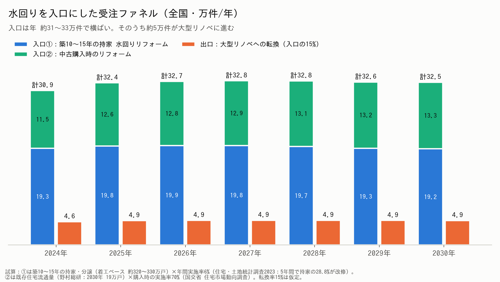
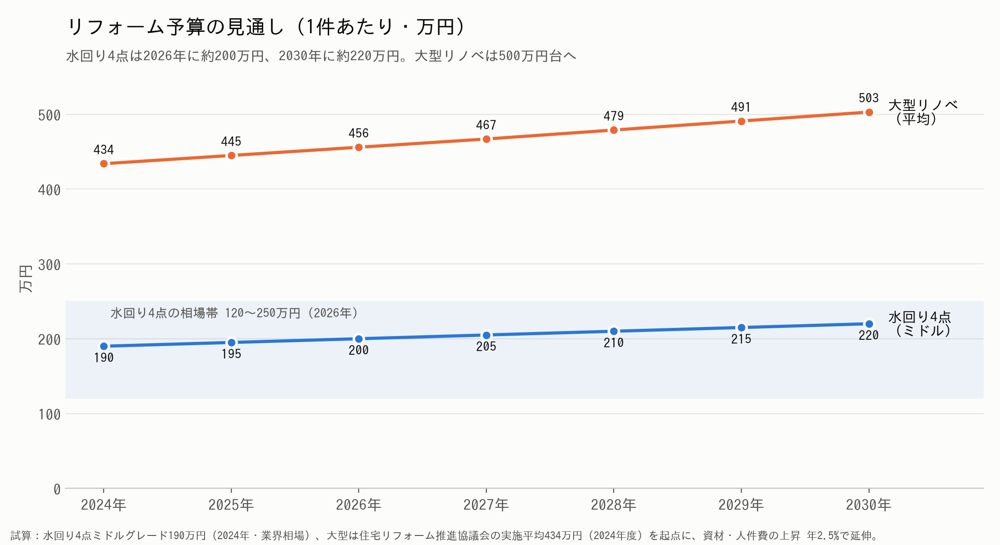

# 2026年 リフォーム業界 市場分析と事業展開の骨子

> 凡例：**【データ】**＝公的統計・調査機関の数値／**【試算】**＝データをもとにした仮説値（自社データで要検証）

---

## 1. 市場の全体像（新築 vs リフォーム）

| 指標 | 実績・予測 | 出典 |
|---|---|---|
| 新設住宅着工（2025年度） | **71.1万戸（前年度比 −12.9%）**／持家 20.1万戸（4年連続減、2021年比 約−30%） | 【データ】国交省 住宅着工統計 |
| 新設住宅着工（予測） | 2030年度 80万戸 → **2040年度 61万戸** | 【データ】野村総研（2026年6月） |
| リフォーム市場（2025年） | **7兆5,119億円（+2.5%）** | 【データ】矢野経済研究所 |
| リフォーム市場（2026年予測） | **約7.7兆円（+1.9%）** ※資材・人件費の上昇による単価アップが主因 | 【データ】矢野経済研究所 |
| リフォーム市場（長期） | 広義 2024年 約8.3兆円 → **2040年 9.2兆円** | 【データ】野村総研 |

**結論：新築は縮小、リフォームは「微増＋単価上昇」。件数より“1件あたりの提案価値”で勝負する市場になる。**

---

## 2. 家計の状況（買えない・買わない層の増加）

| 指標 | 数値 | 意味 | 出典 |
|---|---|---|---|
| 世帯平均所得（2024年） | **575.2万円**（+7.3%） | 平均値は上昇 | 【データ】厚労省 国民生活基礎調査2025 |
| 世帯所得の中央値 | **451万円** | 「普通の世帯」は約450万円 | 同上 |
| 平均を下回る世帯 | **61.5%** | 高所得層が平均を引き上げており、格差がある | 同上 |
| 実質賃金（2025年） | **−1.3%（4年連続マイナス）** | 名目は増えても生活実感は悪化 | 【データ】厚労省 毎月勤労統計 |

| 世帯タイプ | 行動 | 当社にとっての意味 |
|---|---|---|
| 高所得層（年収1,000万円〜） | 新築・高額リノベを両方検討 | デザイン性・提案力で選ばれる |
| 中間層（400〜800万円） | **新築はあきらめて「今の家を直す」** | **最大のボリュームゾーン** |
| 低所得層・高齢世帯 | 壊れたら直す（必要最低限） | 水回り・給湯器の交換需要 |

---

## 3. SWOT（2026年時点）

| | プラス要因 | マイナス要因 |
|---|---|---|
| **内部** | **S：強み** ・インテリアとリフォームを一体で提案できる ・店舗で実物を見せられる ・家具・内装・設備をまとめて扱える | **W：弱み** ・職人の確保・施工力に限りがある ・資材価格の上昇で見積もりが上がる ・提案から成約までに時間がかかる |
| **外部** | **O：機会** ・新築離れで「住み替えずにリフォーム」へ移行 ・築20年超の住宅が多く、水回りの交換時期を迎えている ・省エネ／断熱改修の補助金 ・SNSで「好み」はあるが「選べない」人が多い | **T：脅威** ・実質賃金のマイナスで予算が抑えられる ・ホームセンターやネット専業の低価格競争 ・職人の高齢化と人手不足 ・金利上昇でリフォームローンが組みにくくなる |

---

## 4. 2026→2030 今後の展望

| 項目 | 2026年 | 2028年 | 2030年 |
|---|---|---|---|
| 新築 | 反動減から緩やかに回復 | 持家は減少が続く | 着工は80万戸前後、持家比率は低下 |
| リフォーム | 7.7兆円（単価上昇） | 部分改修の複数回化 | 省エネ・断熱・バリアフリーが標準化 |
| 顧客 | 予算超過を警戒 | 「段階的リフォーム」が定着 | 中古購入とリノベの同時実施が一般化 |
| 求められる価値 | 価格の透明性 | 優先順位づけの提案 | 住まい全体のプロデュース |

---

## 5. 水回り・部位別の更新サイクルと費用目安

| 部位 | 更新目安 | 費用目安（工事込） | 需要の性質 |
|---|---|---|---|
| 給湯器 | 10〜15年 | 20〜50万円 | 故障による**緊急需要**（入口商材） |
| トイレ | 10〜15年 | 20〜50万円 | 節水・掃除のしやすさ |
| 洗面台 | 15〜20年 | 20〜50万円 | 収納・デザイン |
| キッチン | 15〜20年 | 60〜150万円 | **デザイン需要が最大** |
| 浴室 | 15〜20年 | 80〜150万円 | 断熱・ヒートショック対策 |
| 壁紙（クロス） | 10年前後 | 1部屋 5〜15万円 | **低単価でイメージを一新** |
| 床 | 15〜25年 | 1部屋 10〜30万円 | 劣化・ペット・バリアフリー |
| 外壁・屋根 | 10〜15年（塗装） | 100〜200万円 | 資産維持（訪問販売との競合） |

※費用は業界一般の目安。【試算】

**導線設計：給湯器／トイレ（入口）→ 洗面・壁紙（ついで）→ キッチン・LDK（本命）→ 外装（資産維持）**

---

## 6. リフォームの予算実態

| 指標 | 数値 | 出典 |
|---|---|---|
| 検討時の予算（平均） | **約291万円** | 【データ】住宅リフォーム推進協議会（2024年度） |
| 実際の費用（平均） | **約434万円（過去最高）** | 同上 |
| マンションの平均費用 | 約317万円（希望予算 約274万円） | 同上 |
| 予算超過の理由 | 「工事箇所が増えた」42% ／「設備をグレードアップした」40% | 同上 |

**示唆：予算から平均で約1.5倍に膨らむ。「最初から上限を決めて、その中で最適な組み合わせを示す」提案に価値がある。**

---

## 7. 世帯年収別の投資可能額（試算）

| 世帯年収 | リフォーム投資可能額 （1回あたり） | 家具・インテリア投資額 （リフォームと同時） | コーディネート料 （払える／払いたい額） | 主な商材 |
|---|---|---|---|---|
| 〜400万円 | 50〜150万円 | 10〜30万円 | 0〜1万円（無料相談が前提） | 水回り単品・壁紙 |
| 400〜600万円 （中央値層） | 150〜300万円 | 30〜60万円 | **1〜3万円** | 水回り＋1部屋 |
| 600〜800万円 | 300〜500万円 | 60〜120万円 | **3〜8万円** | キッチン＋LDK |
| 800〜1,000万円 | 500〜800万円 | 100〜200万円 | 8〜15万円 | LDK全体・複数部屋 |
| 1,000万円〜 | 800万円〜 | 200万円〜 | 15万円〜（または工事費の5〜10%） | フルリノベ |

【試算の考え方】リフォーム費は年収の約0.3〜0.8倍、家具はリフォーム費の約15〜25%、コーディネート料はリフォーム費と家具費の合計の約1〜3%（単独で払う場合の心理的な上限）。リ推協の平均434万円は年収600〜800万円の層と合致する。

**設計案：コーディネート料は「工事・家具を成約したら差し引く（実質無料）」とし、単独利用には1〜3万円のライトプランを用意する。**

---

## 8. インテリアデザインのニーズと当社の役割

| 顧客の状態 | 課題 | 当社が提供する解決策 |
|---|---|---|
| SNS・Pinterestで情報は豊富 | 選択肢が多すぎて**決められない** | 好みの診断（3つのテイストに絞り込む） |
| 好みはある | 組み合わせると**まとまらない** | 床・壁・建具・家具をまとめたパッケージ提案 |
| 予算に不安がある | 工事箇所が増えて**予算を超える** | **予算の上限を先に決め、優先順位をつけた段階プラン** |
| 実物を見たい | ネットでは質感がわからない | 店舗でのサンプル・ショールーム体験 |

---

## 9. 店舗の状況（2026年）※自社データで記入

| 項目 | 確認する指標 | 現状（記入欄） |
|---|---|---|
| 来店理由 | 故障／デザイン／住み替え の比率 | |
| 平均成約単価 | 部位別・年収帯別 | |
| 予算と成約額の差 | 初回予算 → 成約額 | |
| 失注理由 | 価格／決められない／工期 | |
| 家具の同時購入率 | リフォーム顧客のうち家具も購入した割合 | |

---

## 10. 事業展開の骨子（結論）

| # | 戦略 | 具体策 | KPI |
|---|---|---|---|
| 1 | **入口商材で集客する** | 給湯器・トイレ・壁紙の定額パック | 新規来店数・問い合わせ数 |
| 2 | **予算起点の提案** | 「年収→予算上限→優先順位」を示す3つの松竹梅プラン | 予算超過によるクレーム率・成約率 |
| 3 | **コーディネートで差別化** | 内装と家具をセットで提案（成約時は無料、単独は1〜3万円） | 家具同時購入率・客単価 |
| 4 | **段階的リフォームで顧客を育成** | 10年の住まい計画書を渡し、次の工事時期を通知 | リピート率・LTV |
| 5 | **補助金の活用支援** | 省エネ・断熱補助を組み込んだ見積もり | 補助金を活用した件数 |
| 6 | **施工力の確保** | 協力職人のネットワーク化・工期の平準化 | 工期遵守率 |

**一言でいうと：「新築をあきらめた中間層」に向けて、“予算内で最適な住まい”をコーディネートで設計する会社になる。**

---

## 補足：新設住宅着工の推移（2024→2030年度）

| 年度 | 着工戸数 | 前年度比 | 区分 |
|---|---|---|---|
| 2024 | 81.6万戸 | ― | 実績（省エネ基準の義務化前の駆け込み） |
| 2025 | **71.1万戸** | **−12.9%** | 実績（反動減。持家は20.1万戸で−7.7%） |
| 2026 | 73万戸 | +2.8% | 野村総研の予測（建設経済研究所は77.7万戸） |
| 2027 | 75万戸 | +2.7% | 野村総研の予測 |
| 2028 | 約77万戸 | 約+2.5% | 補間値（2027年度と2030年度の間を均等に配分） |
| 2029 | 約78.5万戸 | 約+2% | 補間値 |
| 2030 | **80万戸** | 約+2% | 野村総研の予測（ここがピーク） |
| 2040 | 61万戸 | 2030年度比 約−24% | 野村総研の予測（持家は14万戸） |

**読み方：2026〜2030年度の増加は反動減からの「揺り戻し」であり、2030年度でも2024年度の水準（81.6万戸）に戻らない。持家は2040年度に14万戸まで減る見込みで、戸建て新築の市場は縮小が続く。**

---

## 補足：地域別の新築着工とリフォーム需要

### 2025年 地域別の着工（暦年・国交省）
| 地域 | 総数 | 前年比 | 持家 | 貸家 | 分譲 | 判定 |
|---|---|---|---|---|---|---|
| 首都圏 | 26.9万戸 | −5.9% | 4.3万（−7.2%） | 13.1万（**−0.9%**） | 9.3万（−11.5%） | 貸家は横ばい、持家・分譲は減少 |
| 近畿圏 | 13.0万戸 | **−1.6%** | 2.7万（−5.6%） | 6.2万（**−0.2%**） | 4.0万（**−0.9%**） | **ほぼ横ばい**（全国で最も底堅い） |
| 中部圏 | 8.5万戸 | −7.1% | 3.1万（−5.9%） | 3.0万（−4.0%） | 2.3万（−9.9%） | 減少（持家の比率が高い） |
| その他地域 | 25.7万戸 | **−9.2%** | ― | ― | ― | **減少幅が最大** |
| 全国 | 74.1万戸 | −6.5% | | | | 3年連続の減少 |

※年間を通じて前年を上回った都道府県は確認できない。局地的に伸びているのは半導体工場の周辺（熊本県菊陽町＝TSMC、北海道千歳市＝ラピダス）で、賃料が1.7〜2.2倍に上がっており、賃貸住宅の需要が中心。

### 地域ごとのリフォーム需要【試算・仮説】
| 地域 | 住宅の特徴 | 主なリフォーム需要 | 当社の打ち手 |
|---|---|---|---|
| **首都圏** | 新築価格が高く、持家の新築は少ない。中古マンションの流通が多い | **中古マンションの購入＋リノベ**、専有部の水回り一式、狭い空間の収納・インテリア | 「中古購入＋リノベ＋家具」のワンストップ提案、コーディネート料を取りやすい |
| **近畿圏** | 新築は横ばいで、分譲マンションが底堅い | マンションの内装・水回り、築古戸建ての再生 | 新築マンション入居時のオプション・家具提案、築古戸建てのリノベ |
| **中部圏** | 持家（戸建て）の比率が高く、敷地が広い | 戸建ての**水回り一式・外装**、二世帯化、減築 | 外装と水回りのセット、親世代向けバリアフリー |
| **地方** | 新築の減少が最大。高齢化が進み、空き家が増加 | **給湯器・トイレ・浴室**の交換、断熱窓（特に寒冷地）、相続した実家の改修 | 補助金を活用した断熱改修、少額の定額パックで入口をつくる |
| **局地（熊本・千歳など）** | 賃貸住宅の新築と賃料が上昇 | 賃貸オーナー向けの内装・原状回復、社宅の家具 | 法人・オーナー向けの家具付きパッケージ |

**読み方：新築が横ばいなのは近畿圏と首都圏の貸家だけ。持家の新築はどの地域でも減っている。首都圏は「中古＋リノベ＋インテリア」で単価が高く、地方は「水回り・断熱の交換」で件数が多い。**

---

## 補足：住宅リフォーム受注件数の推移（2024→2030年度）

| 年度 | 住宅の受注件数 | 住宅の受注高 | 区分 |
|---|---|---|---|
| 2024 | 住宅分は未取得（全体：約816万件） | 4兆1,318億円（−3.3%） | 実績（国交省） |
| 2025 | **約747万件**（全体：1,097万件、+34.5%） | **4兆9,033億円（+18.7%）** | 実績（国交省） |
| 2026 | 約710万件（672〜747万件） | ― | 試算。4〜6月の住宅受注高は前年同期比 −7.6% |
| 2027 | 約703万件（659〜747万件） | ― | 試算 |
| 2028 | 約696万件（646〜747万件） | ― | 試算 |
| 2029 | 約689万件（633〜747万件） | ― | 試算 |
| 2030 | **約682万件**（620〜747万件） | ― | 試算 |

※試算は「標準（強気〜弱気）」の順。標準は2026年度 −5%、以降は年 −1%（市場 +1.5% − 単価 +2.5%）。強気は横ばい、弱気は2026年度 −10%、以降は年 −2%。
※2025年度の1件あたりの平均は約66万円（小規模な修繕を含む）。この調査は標本調査のため、件数は年によって±30%ほど振れる。

**読み方：市場規模（金額）が伸びるのは単価の上昇による。件数は横ばい〜微減で、1件あたりの提案価値（客単価・家具の同時購入）で売上を伸ばす必要がある。**

---

## 補足：中古購入の増加と「水回り入口→大型リノベ」シナリオ（2024→2030年）

### 中古住宅の購入は増えているか【データ】
| 指標 | 数値 | 出典 |
|---|---|---|
| 首都圏 中古マンション成約（2025年） | **4万9,114件（+31.9%、3年連続増）**、成約価格は5,200万円 | 東日本レインズ |
| 首都圏 中古戸建て成約（2025年） | **2万1,632件（+52.5%）**、成約価格は3,917万円 | 東日本レインズ |
| 中古購入と同時のリフォーム | **約7割**が購入時に何らかのリフォームを実施 | 国交省 住宅市場動向調査 |
| 中古マンションを選んだ理由 | 「予算的に手頃だった」75.7% | 同上 |
| 既存住宅流通量（全国） | 2018年 16万戸 → **2030年 19万戸** | 野村総研 |

→ **新築が減る一方で、中古購入＋リフォームは増加傾向にある（特に首都圏）。**

### 水回りを入口にした件数の予測（全国・万件/年）【試算】
| 年 | ①築10〜15年の持家 水回り | ②中古購入時のリフォーム | 入口の計 | 大型リノベへの転換（15%） | 水回り4点の予算 | 大型リノベの予算 |
|---|---|---|---|---|---|---|
| 2024 | 19.3 | 11.5 | 30.9 | 4.6 | 190万円 | 434万円 |
| 2025 | 19.8 | 12.6 | 32.4 | 4.9 | 195万円 | 445万円 |
| 2026 | 19.9 | 12.8 | **32.7** | **4.9** | **200万円** | 456万円 |
| 2027 | 19.8 | 12.9 | 32.8 | 4.9 | 205万円 | 467万円 |
| 2028 | 19.7 | 13.1 | 32.8 | 4.9 | 210万円 | 479万円 |
| 2029 | 19.3 | 13.2 | 32.6 | 4.9 | 215万円 | 491万円 |
| 2030 | 19.2 | 13.3 | 32.5 | 4.9 | **220万円** | **503万円** |

**試算の前提**
- ①：築10〜15年の持家・分譲（その年の10〜15年前の着工数の合計で約320〜330万戸。国交省 住宅着工統計の概数）× 年間実施率6%。6%は、住宅・土地統計調査2023で「5年間に持家の28.8%が改修した」ことから年率に換算した値。
- ②：既存住宅流通量（野村総研の予測を補間）× 購入時の実施率70%。
- 転換率15%は仮定（予算超過の理由の42%が「箇所が増えた」＝リ推協）。予算は年2.5%の単価上昇で延ばした値。
- 入口の市場規模：約32万件 × 約200万円 ≈ **年6,500億円**。大型：約5万件 × 約470万円 ≈ **年2,300億円**。

### 予算は200万円前後が妥当か（10年使う前提）【試算】
| 世帯年収 | 手取り（概算） | 10年で割った年間負担の上限（手取りの5%） | **水回りに出せる予算** | 月あたり |
|---|---|---|---|---|
| 500万円 | 約390万円 | 約19.5万円 | **約195万円** | 約1.6万円 |
| 600万円 | 約460万円 | 約23万円 | **約230万円** | 約1.9万円 |
| 700万円 | 約530万円 | 約26.5万円 | 約265万円 | 約2.2万円 |
| 800万円 | 約600万円 | 約30万円 | 約300万円 | 約2.5万円 |

→ **200万円前後は、年収500〜600万円の持家世帯でも「10年割で月1.6〜1.9万円」になり、無理のない上限。** 相場（4点セット120〜250万円、ミドルグレードで約200万円）とも一致する。年収700万円以上なら、水回り＋内装（床・壁）で250〜300万円まで提案できる。

### シナリオの骨子
| 段階 | 内容 | 予算 |
|---|---|---|
| ① 接点 | 給湯器・トイレの交換（築10年前後） | 20〜50万円 |
| ② 入口 | 水回り4点セット（築10〜15年／中古購入時） | **150〜250万円（中心は約200万円）** |
| ③ 拡張 | ＋床・壁・照明・家具のコーディネート | ＋50〜100万円 |
| ④ 大型 | LDKの間取り変更・全面リノベ（入口の約15%） | 450〜500万円以上 |

---

## 補足：利益モデル（水回り入口 → コーディネート → 大型リノベ）【試算】

### 業界の利益水準【データ】
| 指標 | 水準 |
|---|---|
| リフォーム業の粗利率 | 平均 約30%（中小 15〜25%、大手 30%前後）。28%を切ると経営が厳しい |
| 営業利益率 | 5%あれば良い方。1〜3%の会社も多い |

### 段階別の1件あたり利益
| 段階 | 単価 | 粗利率 | 1件の粗利 | 役割 |
|---|---|---|---|---|
| 接点（給湯器・トイレ） | 20〜50万円 | 15〜20% | 4〜10万円 | 集客用（利益は薄い） |
| 入口（水回り4点） | 約200万円 | 28% | **約56万円** | 利益の土台 |
| 追加（床・壁・照明・家具） | 約80万円 | 33% | **約26万円** | 利益率が最も高い（コーディネートの効果） |
| 大型リノベ | 約470万円 | 30% | **約141万円** | 利益の柱 |

### 入口100件あたりの売上と粗利（年間）
| 項目 | 件数 | 売上 | 粗利 |
|---|---|---|---|
| 水回り4点 | 100件 | 2.0億円 | 5,600万円 |
| 内装・家具の追加（40%） | 40件 | 0.32億円 | 1,056万円 |
| 大型リノベ（15%） | 15件 | 0.71億円 | 2,115万円 |
| **合計** | | **約3.0億円** | **約8,770万円（粗利率29%）** |
| 参考：水回りだけの場合 | 100件 | 2.0億円 | 5,600万円 |

→ **同じ100人の顧客から、粗利が約1.6倍（+3,170万円）になる。** 営業利益率5%なら約1,500万円、8%なら約2,400万円。

### 利益を上げる5つのレバー
| # | レバー | 目標 | 粗利への効果（入口100件あたり） |
|---|---|---|---|
| 1 | 内装・家具の追加率を上げる | 40% → 60% | ＋約520万円 |
| 2 | 大型リノベへの転換率を上げる | 15% → 20% | ＋約700万円 |
| 3 | 水回りの粗利率を守る（値引きではなくグレード提案） | 25% → 28% | ＋約600万円 |
| 4 | 有料のコーディネート（単独利用 1〜3万円） | 年50件 | ＋50〜150万円（ほぼ全額が利益） |
| 5 | 10年の住まい計画で再受注（外装・給湯器） | リピート率 30% | 広告費ゼロの受注 |

**ポイント：水回りは「集客と信頼づくり」、利益は「追加の内装・家具」と「大型リノベ」で得る。コーディネートが両方の転換率を上げる鍵になる。**

---

## 補足：5年間の拡大シナリオ（2026→2030年）

### ターゲットの優先順位
| 優先度 | ターゲット | 規模（全国/年） | 予算 | 選ぶ理由 |
|---|---|---|---|---|
| **◎ 最優先** | **築10〜15年の持家（戸建て・マンション）**、40〜50代、世帯年収600〜800万円 | 約20万件 | 水回り約200万円＋内装・家具 | 件数が最も多い。予算が合う。家具・大型への追加が見込める |
| **○ 第2** | **中古購入者**（30〜40代、年収600〜900万円、特に首都圏） | 約13万件（増加中） | 400〜500万円＋家具 | 成約が+32〜52%と伸びている。1件の単価が高い。購入時の7割がリフォームする |
| △ 維持 | 築20年超・高齢世帯（給湯器・トイレの交換） | 多い | 20〜50万円 | 集客の接点として使う。利益は薄いので深追いしない |
| × 対象外 | 単品の最安値を求める層 | ― | ― | ホームセンター・ネット専業と価格競争になる |

### サービスの優先順位と5年ロードマップ
| 年 | 重点サービス | 狙い | 主なKPI |
|---|---|---|---|
| **2026** | ① **水回り4点の定額パック**（150／200／250万円の3グレード）＋ 無料のコーディネート診断 | 入口の件数をつくる | 水回り 60件、追加率 30% |
| **2027** | ② **コーディネートの商品化**（床・壁・照明・家具のセット提案、単独利用は1〜3万円） | 客単価と粗利率を上げる | 追加率 40%、中古リノベ 10件 |
| **2028** | ③ **中古購入＋リノベのワンストップ**（不動産会社と提携、購入前の見積もり同行） | 第2ターゲットを取り込む | 中古リノベ 25件、大型転換 15% |
| **2029** | ④ **大型リノベ・断熱改修**（LDK・間取り変更、補助金の活用） | 利益の柱を育てる | 大型転換 18%、補助金の活用件数 |
| **2030** | ⑤ **10年の住まい計画・リピート**（外装・給湯器の次回提案、賃貸オーナー・法人向け） | 広告費をかけずに受注する | リピート率 30% |

### 1店舗の5年計画（例）【試算】
| 年 | 水回り（入口） | 追加率 | 大型転換率 | 中古リノベ | **売上** | **粗利** |
|---|---|---|---|---|---|---|
| 2026 | 60件 | 30% | 10% | 0件 | 1.6億円 | 0.47億円 |
| 2027 | 80件 | 40% | 12% | 10件 | 2.9億円 | 0.84億円 |
| 2028 | 100件 | 50% | 15% | 25件 | 4.6億円 | 1.34億円 |
| 2029 | 120件 | 55% | 18% | 40件 | 6.3億円 | 1.87億円 |
| 2030 | 140件 | 60% | 20% | 50件 | **7.9億円** | **2.33億円** |

※単価は水回り約200万円・追加約80万円・大型約456万円・中古リノベ約500万円（いずれも年2.5%上昇）、粗利率は28〜33%。件数と転換率は目標値の例で、自社の実績に合わせて調整する。

**シナリオの一言：「築10〜15年の持家の水回り」で接点をつくり、コーディネートで単価を上げ、3年目から中古購入リノベと大型リノベで利益を伸ばす。**

---

## 補足：個人向けオンラインコーディネートのAI活用と月300万円シナリオ【試算】

### AIに任せる工程と、Riekoが担う工程
| 工程 | 現状の工数（1件） | AI活用後 | AIの役割 | Riekoの役割 |
|---|---|---|---|---|
| 事前ヒアリング | 30分 | 0分 | 事前フォーム（部屋の写真・寸法・予算・好みの画像）を整理 | ― |
| オンライン面談 | 60分 | 60分 | 録音を文字起こしし、要件シートを自動作成 | **話を聞き、好みを読み取る（ここは人が担う）** |
| お部屋のイメージ作成 | 180分 | 30分 | 部屋の写真をもとにスタイリング案を2〜3案生成 | 案を選び、色・素材を修正 |
| 家具の選定 | 120分 | 30分 | **Rieko厳選の商品マスター**から、テイスト・予算・寸法で候補を抽出 | 最終的な組み合わせを決める |
| 商品リスト・見積もり | 60分 | 10分 | リスト（product_list形式）と合計金額を自動作成 | 確認 |
| 修正対応 | 60分 | 30分 | 差し替え候補を自動で提示 | 判断のみ |
| **合計** | **約8.5時間** | **約2.7時間（約3分の1）** | | |

### Riekoのセンスを反映させる仕組み（AIに「Riekoらしさ」を教える）
| 準備するもの | 内容 | 効果 |
|---|---|---|
| ① スタイル辞書 | 5〜8テイストの定義（配色の比率、素材、木の色、NGの組み合わせ） | AIの提案がRiekoの基準から外れない |
| ② 過去事例集 | 20〜30件のビフォー・アフター写真と商品リスト | 「この部屋ならこう組む」をAIが参照できる |
| ③ 商品マスター | Riekoが選んだ300〜500点（寸法・価格・テイストタグ・仕入れ先） | **AIはこの中からしか選ばない＝センスが保たれる** |
| ④ 最終チェック | 納品前にRiekoが15〜30分確認する | 品質と「Rieko監修」というブランドを守る |

**AIの限界：** 生成した部屋のイメージに、実在する家具を正確に描くことはまだ難しい。イメージは「雰囲気」として使い、実際の商品写真を並べたムードボードと組み合わせる。寸法や動線の最終判断は人が行う。

### 月300万円の収益シナリオ（収益＝コーディネート料＋家具販売の粗利）
| プラン | 料金 | 月の件数 | 料金収入 | Riekoの作業時間 |
|---|---|---|---|---|
| ライト（オンライン・1部屋） | 3万円 | 15件 | 45万円 | 2時間×15＝30時間 |
| スタンダード（LDK） | 8万円 | 8件 | 64万円 | 3.5時間×8＝28時間 |
| プレミアム（複数の部屋・訪問あり） | 20万円 | 2件 | 40万円 | 8時間×2＝16時間 |
| **コーディネート料 計** | | **25件** | **149万円** | **74時間** |
| 家具販売の粗利 | 25件×購入率50%×平均40万円＝売上500万円×粗利率30% | | **150万円** | ― |
| **月の収益 合計** | | | **約300万円** | |

| 費用（月） | 金額 |
|---|---|
| Riekoの作業時間（74時間×5,000円で換算） | 37万円 |
| AI・ツール | 約5万円 |
| 集客（1件あたり1万円） | 25万円 |
| **利益（概算）** | **約230万円（収益の約77%）** |

- AIを使わない場合、同じ25件で約212時間かかり、1人では回らない。
- コーディネート料だけで月300万円にするには、月49件・約145時間が必要。**家具販売と組み合わせる方が件数が半分で済み、現実的。**
- コーディネート後のリフォーム紹介（水回り・内装）は、この300万円とは別の上乗せになる。

### 導入ステップ
| 時期 | やること |
|---|---|
| 1〜2か月目 | スタイル辞書と過去事例集をつくる。商品マスターを300点から始める |
| 3か月目 | ヒアリングフォームと要件シートの自動化。家具候補の抽出とリスト作成を自動化 |
| 4〜6か月目 | 部屋のイメージ生成とムードボード作成を導入。ライトプランを月10件で試す |
| 7か月目〜 | 件数を月25件まで増やし、スタンダード・プレミアムを拡大 |

---

## 補足：コーディネートを頼みたい人のインサイトと価格・サービス設計

### 消費者の状況【データ】
| 指標 | 数値 | 出典 |
|---|---|---|
| 今のインテリアに不満がある | **半数以上**。理由の4割超が「色やテイストが統一されていない」 | PR TIMES 住まいのインテリア意識調査 |
| インテリアにこだわりたい | **7割以上** | 同上 |
| 部屋づくりで挫折する理由 | 「センスに自信がない」「完成図が想像できない」 | Z世代ほか1,000人調査（2026年） |
| AIでのコーディネートを希望 | Z世代の「インテリア迷子」の**約8割** | 同上 |
| AIが代替できない領域 | 潜在ニーズの引き出し、照明、動線、素材の質感の判断 | AIインテリアツール解説（2026年） |
| コーディネート料の相場 | 1部屋3〜6万円、LDK10〜30万円、または商品代金の5〜10% | ミツモア、各社の料金 |

### インサイト：「選択肢」はAIで手に入る。足りないのは「判断」と「安心」
| 段階 | 顧客の状態 | AIで解決できるか |
|---|---|---|
| 情報を集める | SNS・AIで画像も商品も大量に見られる | **できる** |
| 案をつくる | AIで部屋のイメージも家具の候補も出せる | **できる** |
| **選ぶ・決める** | 「どれが良いのか」「自分の部屋に合うのか」が判断できない | **できない**（判断の基準がない） |
| **失敗を避ける** | ソファ15万円は返品しにくい。サイズ・色・質感で後悔したくない | **できない**（実物の寸法・光・素材感を確認できない） |
| **確信を持つ** | 「プロが良いと言った」という後押しが欲しい | **できない**（責任を持てない） |

**結論：AIが普及するほど、お金を払う対象は「案をつくる作業」から「判断とお墨付き」に移る。** 頼みたいのは「全部やって」ではなく、「自分で考えた案（またはAIの案）を、プロに判断してほしい」層が増える。

### いくらなら払うか【試算】
| 考え方 | 金額の目安 |
|---|---|
| 失敗を避ける保険として（家具予算40万円の5%） | **約2万円** |
| 判断だけ（30分の診断） | **5,000〜1万円**（買う家具1点分の失敗より安ければ払う） |
| 1部屋のプラン（AI＋プロ） | 3万円前後（市場の相場の下限） |
| LDKのトータル | 8〜10万円 |

→ 心理的な壁は「家具を買うなら充当される」と下がる。**料金を家具購入時に差し引く仕組みが有効。**

### 使いたくなるサービス（優先順）
| # | サービス | 料金 | Riekoの工数 | 狙い |
|---|---|---|---|---|
| 1 | **AI案のプロ診断（セカンドオピニオン）**：自分で作ったAI画像や購入予定の家具を送る → Riekoが○×と、差し替え候補3点を返す | **9,800円**（家具購入時に充当） | 30分 | 新しい入口。件数を増やす |
| 2 | **購入前チェック**：カートの中身（ソファ・ラグ・カーテン）を診断 | 5,000円 | 15分 | 「失敗したくない」に直接応える |
| 3 | 1部屋プラン（AI案＋Rieko監修） | 3万円 | 2時間 | 本命のライトプラン |
| 4 | LDKトータル | 8万円 | 3.5時間 | 家具販売・リフォームにつなげる |

**キャッチコピー案：「AIで選んだ、その家具。買う前にプロが判断します。」**

### 月300万円シナリオへの組み込み（例）
| プラン | 件数 | 収入 | 工数 |
|---|---|---|---|
| AI案のプロ診断 9,800円 | 40件 | 約39万円 | 20時間 |
| ライト 3万円 | 10件 | 30万円 | 20時間 |
| スタンダード 8万円 | 8件 | 64万円 | 28時間 |
| プレミアム 20万円 | 2件 | 40万円 | 16時間 |
| 家具販売の粗利（診断の20%・プランの50%が平均40万円購入、粗利率30%） | | 約216万円 | ― |
| **合計** | **60件** | **約390万円** | **84時間** |

※コーディネート料は約173万円。家具購入は計18件（診断40件×20%、プラン20件×50%）×40万円×30%。診断から家具購入に進む割合は仮定で、半分（10%）なら合計は約340万円。診断は集客の入口として、広告費を下げる効果も見込める。

---

## 補足：「判断」を商品にする ― 買う前ジャッジ（サービス案）

### コンセプト
**「その家具、あなたの部屋に合うか。買う前にプロが判定します。」**
AIで集めた候補や、ネットのカートに入れた家具を送るだけ。Riekoが「◎○△×」で判定し、理由と代わりの候補を返す。

### 手に取りやすくする5つの設計
| # | 設計 | 内容 | ねらい |
|---|---|---|---|
| 1 | **LINEで送るだけ** | 部屋の写真2枚＋だいたいの寸法＋迷っている家具（URL・スクショ・AI画像） | 面談なし・準備5分。始めるハードルを下げる |
| 2 | **答えが1枚のカード** | 「判定カード」で48時間以内に返信（下記） | 何が届くかが事前にわかる＝買いやすい |
| 3 | **1点から買える価格** | 1点 3,300円／部屋まるごと 9,800円 | 「家具の失敗より安い」と即決できる |
| 4 | **購入時に全額充当** | 提案した家具を買えば判定料は実質0円 | 家具販売につながる |
| 5 | **合わなければ再判定無料** | 判定どおりに買って合わなかったら次回無料 | 不安を取り除く |

### 判定カード（届くもの）
| 項目 | 内容 |
|---|---|
| 総合判定 | ◎ そのまま買ってOK ／ ○ 色かサイズを変えればOK ／ △ 組み合わせ次第 ／ × おすすめしない |
| 理由（3行） | 色・サイズ・テイストの3つの視点で一言ずつ |
| 代わりの候補 | Riekoが選んだ商品から3点（価格・リンク付き） |
| 置き方のひとこと | 配置や合わせる小物のアドバイスを1行 |
| Riekoのものさし | どの基準で判定したかを表示（下記） |

### 「Riekoのものさし」＝判断基準を見える化してブランドにする
| ものさし | 例 |
|---|---|
| 色の比率 | ベース70：メイン25：アクセント5 |
| 素材の数 | 1部屋に3種類まで |
| 木の色 | 2トーンまで |
| 高さのリズム | 低・中・高を三角形に配置 |
| 余白 | 床の3割は空ける |

→ 判定の根拠になると同時に、SNSでの発信（「今日のジャッジ」）や、AIへの指示（スタイル辞書）にもそのまま使える。

### 価格と工数
| メニュー | 料金 | Riekoの工数 | 時間あたり |
|---|---|---|---|
| 1点ジャッジ | 3,300円 | 10分（AIが下書き） | 約2万円/時間 |
| 部屋まるごとジャッジ（5点まで） | 9,800円 | 30分 | 約2万円/時間 |
| 1部屋プラン | 3万円 | 2時間 | 約1.5万円/時間 |

### 入口から本命への流れ
| 段階 | 内容 | 料金 |
|---|---|---|
| 無料 | AIのテイスト診断（10問で自分のテイストがわかる） | 0円 |
| 入口 | **買う前ジャッジ** | 3,300〜9,800円 |
| 本命 | 1部屋プラン／LDKトータル | 3〜8万円 |
| 拡張 | 家具の購入、水回り・内装のリフォーム | 数十万〜数百万円 |

### 名前の候補
| 名前 | 印象 |
|---|---|
| **買う前ジャッジ** | 何をしてくれるかが一言でわかる（おすすめ） |
| Riekoのものさし | 個人のブランドを前面に出す |
| インテリア判定便 | 気軽さ・スピード感 |

---

### 出典
- [矢野経済研究所：住宅リフォーム市場に関する調査（2026年）](https://www.yano.co.jp/press-release/show/press_id/4153)
- [野村総合研究所：2026〜2040年度の新設住宅着工戸数・リフォーム市場予測](https://www.nri.com/jp/news/newsrelease/20260618_1.html)
- [新設住宅着工 2025年度 71万1171戸](https://www.kicks-blog.com/entry/2026/05/04/080647)／[ハウジング・トリビューン](https://www.housenews.jp/research/35902)
- [建設経済研究所 2026年度の見通し（BuildApp News）](https://housing-news.build-app.jp/article/36965/)／[日経：野村総研 2026〜2040年度予測](https://www.nikkei.com/article/DGXZRSP708697_Y6A610C2000000/)
- [2025年 地域別着工の集計](https://link-estate.kikirara.jp/blogs/2025%E5%B9%B4%E3%81%AE%E5%85%A8%E5%9B%BD%E6%96%B0%E8%A8%AD%E4%BD%8F%E5%AE%85%E7%9D%80%E5%B7%A5%E6%88%B8%E6%95%B0%EF%BC%8F3%E5%B9%B4%E9%80%A3%E7%B6%9A%E6%B8%9B%EF%BC%8F74%E4%B8%87665%E6%88%B8%EF%BC%8F/)／[LIFULL HOME'S：TSMC・ラピダス周辺の賃貸市場](https://www.homes.co.jp/cont/press/report/report_00442/)
- [国交省 建築物リフォーム・リニューアル調査 2024年度計](https://www.mlit.go.jp/report/press/content/001894226.pdf)／[2025年度 住宅受注高18.7%増（新建ハウジング）](https://www.s-housing.jp/archives/423978)／[2026年度4〜6月 住宅7.6%減](https://www.s-housing.jp/archives/430889)
- [東日本レインズ 2025年 首都圏中古住宅市場](https://www.reins.or.jp/pdf/trend/sf/sf_2025.pdf)／[国交省 令和6年度 住宅市場動向調査](https://www.mlit.go.jp/report/press/content/001900652.pdf)／[総務省 令和5年住宅・土地統計調査](https://www.stat.go.jp/data/jyutaku/2023/pdf/kihon_gaiyou.pdf)／[野村総研 既存住宅流通量予測](https://www.nri.com/jp/news/newsrelease/20220609_1.html)／[水回り4点の費用相場（リフォームガイド）](https://www.reform-guide.jp/topics/mizumawarisantensetto-reform-hiyou/)
- [リフォーム会社の利益率（ANDPAD）](https://andpad.jp/columns/0070)／[リフォームの利益率（LIXILリフォームビジネス）](https://www.lixil-reformshop.jp/fcvcblog/article/%E3%83%AA%E3%83%95%E3%82%A9%E3%83%BC%E3%83%A0%E5%88%A9%E7%9B%8A%E7%8E%87/)
- [住まいのインテリアに関する意識調査（PR TIMES）](https://prtimes.jp/main/html/rd/p/000000026.000062185.html)／[Z世代のインテリア迷子とAI（PR TIMES）](https://prtimes.jp/main/html/rd/p/000000264.000036168.html)／[ミツモア コーディネーター料金相場](https://meetsmore.com/services/interrior-designer)／[AIインテリアデザインとプロの役割](https://renue.co.jp/posts/ai-interior-design-room-layout-tools-guide-2026)
- [厚生労働省：2025年 国民生活基礎調査の概況](https://www.mhlw.go.jp/toukei/saikin/hw/k-tyosa/k-tyosa25/dl/14.pdf)／[日本経済新聞](https://www.nikkei.com/article/DGXZQOUA1485P0U6A710C2000000/)
- [JILPT：2025年の実質賃金 −1.3%（4年連続マイナス）](https://www.jil.go.jp/kokunai/blt/backnumber/2026/04/kokunai_01.html)
- [住宅リフォーム推進協議会 調査（新建ハウジング）](https://www.s-housing.jp/archives/378713)／[ハウジング・トリビューン](https://htonline.sohjusha.co.jp/20250225-1/)
